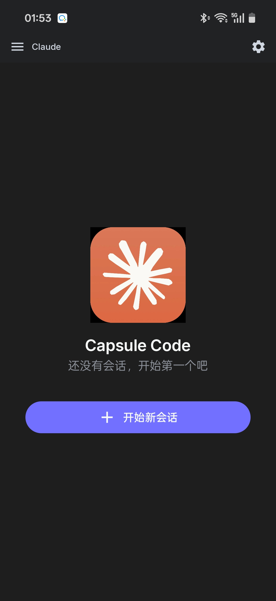
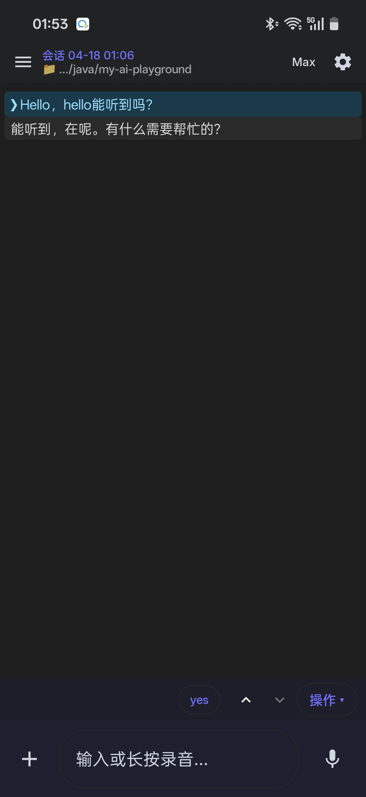

# Capsule Code

> 把 Claude Code 装进你的口袋。一个手机端对话界面 + 一个能跑 `claude` 命令的后端，让你在地铁上、咖啡馆里、床上都能写代码。

[](LICENSE)
[](android/)
[](backend/)
[](docker/)

---

## 这是什么

**Capsule Code** = 一个 Android app + 一个 Java 后端，把 Claude Code CLI 包装成手机上能用的对话界面。

- 📱 **手机端**：Jetpack Compose 写的原生 App，左抽屉管理会话、右齿轮调设置、底部麦克风实时语音输入
- 🖥 **后端**：Spring Boot + `tmux` + FIFO 管道驱动 `claude` CLI；客户端以 cursor 为锚点 HTTP 轮询拉 stream-json 增量（另一条 WebSocket 通道专门跑 hook 事件和推送通知）
- 🔌 **一键部署**：`docker compose up -d`，5 分钟让朋友也用上

> 为什么做？因为我受够了每次想到一个 idea，都要回家打开电脑才能让 Claude 帮我动手。现在在床上也能随手跑个 `refactor` 或者 `fix this bug`。

---

## 📸 体验一下

<table>
<tr>
<td align="center" width="50%"><br/><sub>空状态欢迎页 · 一键开始</sub></td>
<td align="center" width="50%"><br/><sub>对话 + 语音输入浮层</sub></td>
</tr>
</table>

---

## ✨ 特性

- **真·Claude Code**，不是套 API：后端实际上跑的是官方 `claude` CLI，所有工具调用、MCP、hooks、sub-agents 一样能用
- **会话持久化**：所有对话存 H2 嵌入式 DB，重启后端不丢，多会话左抽屉切换
- **流式输出**：`GET /claude/v2/stream?cursor=N` HTTP 长轮询，每秒一次拉增量；简单、抗中继不稳、实现比 SSE/WS 都轻
- **中文语音输入**：集成讯飞 RTASR 实时转写，按住说话、说完即出（延迟 <500ms）
- **图片附件**：拍照 / 从相册选，iPhone HEIC 格式自动转 JPEG（Anthropic API 不吃 HEIC）
- **冷启动更新检查**：内置 OTA，新版后端部署后手机自动弹窗提示升级
- **订阅 / API Key 两种登录**：有 Claude Max/Pro 订阅直接挂载 `~/.claude`，没订阅也能填 `ANTHROPIC_API_KEY`

---

## 🚀 5 分钟跑起来

**前提**：一台装了 Docker 的电脑（Mac/Linux/Win 都行）+ 一部 Android 手机 + Anthropic 订阅或 API Key

### 1. 下载打好的分发包

去 [Releases](https://github.com/songxinjianqwe/capsule-code/releases) 下载 `capsule-code-dist-*.tar.gz`（约 100 MB），里面什么都有：Docker、APK、源码一站备齐。

### 2. 起后端

```bash
tar -xzf capsule-code-dist-*.tar.gz
cd capsule-code/docker
cp .env.example .env
# 编辑 .env 填你的 Anthropic API Key 或留空用订阅
# 讯飞 key 想用语音就填，不想用空着也能跑
docker compose up -d
```

首次启动要 3–5 分钟（拉镜像 + 装 claude CLI）。之后秒起。

验证：`curl http://localhost:8082/app/version` 能返回 JSON 就 OK。

### 3. 装 APK

把压缩包里的 `capsule-code.apk` 传到手机，或者：

```bash
adb install capsule-code/capsule-code.apk
```

启动 App → 右上角齿轮 → 「服务器地址」填刚才跑 Docker 的电脑 IP（比如 `192.168.1.100:8082`）→ 回主页点「开始新会话」。

---

## 🏗 架构

```
                       POST /claude/v2/messages (发消息)
                       GET  /claude/v2/stream?cursor=N (每秒轮询增量)
┌──────────────────┐   POST /claude/upload (图片)      ┌──────────────────────┐
│  Android App     │ ──────────────────────────────▶│   Spring Boot :8082  │
│  (Kotlin Compose)│ ◀──────── increments ──────────│                      │
│                  │                                │   ┌──────────────┐   │
│                  │ ◀── WebSocket /ws/push ────────│   │ TmuxProcess  │   │
└──────────────────┘    (hook 事件 + OTA 通知)       │   │  Manager     │   │
          │                                         │   └──────┬───────┘   │
          │ HTTP /xfyun/credentials                 │          │ spawn     │
          ▼                                         │          ▼           │
┌──────────────────┐                                │   ┌──────────────┐   │
│  讯飞 RTASR      │                                │   │ tmux session │   │
│  实时语音转写    │                                │   │   └── claude │   │
└──────────────────┘                                │   │         CLI  │   │
                                                    │   └──────┬───────┘   │
                                                    │          │ FIFO      │
                                                    │          ▼           │
                                                    │   ClaudeOutputBuffer │
                                                    │   （cursor-based）   │
                                                    │                      │
                                                    │   H2 DB + 文件存储   │
                                                    └──────────────────────┘
```

核心 trick：
- **每个会话一个独立 tmux session 跑 `claude`**，用 FIFO 管道写消息、读 stream-json 输出。`tmux` 让 CLI 看到伪终端，非 tty 环境下一些交互式提示才不会丢。
- **HTTP 长轮询 > WebSocket**：Claude 输出带 cursor 递增编号存在 `ClaudeOutputBuffer`，App 每秒 `GET /stream?cursor=N` 拉自己没拿过的部分。相比 WebSocket：断网重连不丢数据（cursor 幂等重放）、穿透 Tailscale / Cloudflare Tunnel 时连接更稳、实现简单。代价是延迟 ~0.5-1s，对 Claude 这种"思考→一大段输出"的节奏几乎不影响体感。
- **WebSocket 只承载推送通知**：hook 事件（stop / notification）、OTA 更新提醒等；对话内容不走它。

---

## 📂 目录结构

```
capsule-code/
├── docker/            # 一键部署（推荐入口）
│   ├── Dockerfile         # eclipse-temurin:17-jre + tmux + claude-cli
│   ├── docker-compose.yml
│   └── .env.example
├── backend/           # Spring Boot 后端（端口 8082）
│   ├── src/main/java/com/xinjian/capsulecode/
│   │   ├── controller/        # REST 端点
│   │   ├── websocket/         # 核心：TmuxProcessManager + ClaudeWebSocketHandler
│   │   ├── shared/            # FileStorage 等共享能力
│   │   └── mapper/            # MyBatis
│   └── src/main/resources/
│       ├── application.yml    # 主配置（公开）
│       └── db/                # H2 建表 SQL
├── android/           # Jetpack Compose App
│   └── app/src/main/java/com/xinjian/capsulecode/
│       ├── ui/claude/         # 主聊天界面 + ViewModel
│       ├── ui/settings/       # 设置页
│       ├── data/              # Retrofit client + SettingsRepository
│       └── util/              # XfyunAsrManager 等
└── bootstrap_scripts/ # 本地非 Docker 启动脚本
```

---

## 🤔 常见问题

<details>
<summary><b>一定要 Claude 订阅吗？可以用 API Key 吗？</b></summary>

两种都行。`.env` 里：
- 留空 `ANTHROPIC_API_KEY` + 挂载宿主机 `~/.claude`（提前 `claude login` 过）→ 用订阅额度
- 填 `ANTHROPIC_API_KEY=sk-ant-...` → 按 token 计费

</details>

<details>
<summary><b>我没有讯飞账号，语音功能会影响其他功能吗？</b></summary>

不会。讯飞 4 个 key 留空，App 启动时会弹一下"语音初始化失败"，然后就再也不打扰了。打字聊天、图片上传一切照常。

</details>

<details>
<summary><b>可以跑在云服务器上吗？</b></summary>

可以，装 Docker 的机器都行。手机端在设置里填服务器公网 IP + 端口就能连。建议配合 Tailscale / Cloudflare Tunnel 走私网，不要直接暴露 8082 到公网。

</details>

<details>
<summary><b>为什么要用 tmux？直接 spawn <code>claude</code> 不行吗？</b></summary>

早期版本就是直接 spawn 的，问题是：claude CLI 在非 tty 环境下行为和 tty 不一致（有些交互式提示不出），stdin/stdout 用管道传容易丢 buffer。用 tmux 包一层后，CLI 看到的是伪终端，行为和你本地 `claude` 一模一样。

</details>

<details>
<summary><b>图片上传报错 "Could not process image"？</b></summary>

如果是 iPhone 原始照片，大概率是 HEIC 格式。后端已内置 HEIC→JPEG 自动转换（基于 `libheif-examples`），Docker 镜像里也装好了。如果还报错，看 `logs/capsule-code.log`。

</details>

<details>
<summary><b>我能自己从源码重编吗？</b></summary>

能。
- 后端：`cd backend && mvn package -DskipTests && java -jar target/*.jar`，首次跑要 `cp config/application-local.yml.example config/application-local.yml` 填配置
- Android：`cd android && cp local.properties.example local.properties` 改 `sdk.dir` → `./gradlew :app:assembleDebug`

</details>

---

## 🛣 Roadmap

- [ ] Release APK 走正式签名（当前是 debug 签名）
- [ ] iOS 端（SwiftUI）—— 有人贡献就做 😊
- [ ] 工具调用可视化（当前是纯文本展示）
- [ ] 手机端内置 SSH 快速跳到代码文件位置
- [ ] 多后端切换（同时管多个项目）

---

## 🤝 贡献

欢迎 Issue 和 PR！不过因为这是我个人玩具项目，响应可能慢，见谅。

报 bug 请附上：
- 后端日志 `logs/capsule-code.log`
- Android 端设置页右下角「导出日志」
- 复现步骤

---

## 📝 License

[MIT](LICENSE) —— 随便用，出问题别找我 🙏

---

## 🙏 致谢

- [Anthropic Claude Code](https://docs.anthropic.com/claude/docs/claude-code) —— 本项目的灵魂
- [讯飞开放平台](https://www.xfyun.cn/) —— 语音识别 SDK
- 所有用过、给过反馈、催过更新的朋友 ❤️

---

<sub>Made with ☕ and 🤖 by [songxinjianqwe](https://github.com/songxinjianqwe)</sub>
